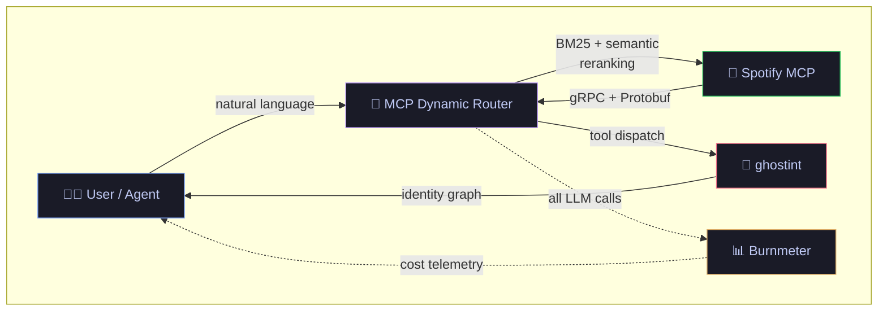

# Hi, I'm Kavin 👋

**Applied AI Engineer** at [Machani Robotics](https://machani.tech) · Building production AI infrastructure for robotics

I work at the intersection of **LLMs** and **real-world systems** — designing gRPC-MCP server architectures, real-time speech pipelines, and local-first observability tools.

```
📍 Bangalore / Chennai, India
🎓 B.E. Computer Science — College of Engineering, Guindy (Anna University)
⚡ Currently: Production AI Infra for Robotics & Stream RAG Routing
```

---

### What I Build

| | Project | What it does |
|---|---|---|
| 🔀 | **[MCP Dynamic Router](https://github.com/Kavin-bm/Mcp-Dynamic-Router)** | High-performance tool router for Model Context Protocol — BM25 + semantic embeddings + LLM reranking with Stream RAG for partial speech transcripts |
| 📊 | **[Burnmeter](https://github.com/Kavin-bm/Burnmeter)** | Local-first LLM token usage & cost observability dashboard — tracks spend across OpenAI, Gemini, and other providers |
| 🎵 | **[Spotify MCP Server](https://github.com/Kavin-bm/Spotify-MCP)** | Hybrid gRPC + MCP server exposing Spotify as AI-native tools for LLM agents |
| 👻 | **[ghostint](https://github.com/Kavin-bm/ghostint)** | AI-powered OSINT framework that traces digital footprints & maps identity graphs |

---

### How It All Connects

> _This is the system I'm building — every project is a node in a larger AI infrastructure._



<details>
<summary><b>🔍 What's happening here?</b></summary>
<br/>

The **MCP Dynamic Router** is the brain — it receives natural language requests and uses a 2-stage ranking pipeline (BM25 lexical matching → semantic embeddings → LLM reranking) to route them to the right tool server.

**Spotify MCP** and **ghostint** are tool servers that speak gRPC + MCP protocol back to the router. **Burnmeter** silently observes every LLM call across the system and tracks token usage & cost in real-time.

The goal: a modular, observable AI infrastructure where adding a new capability is just deploying another MCP server.
</details>

---

### Tech

<p>
  
  
  
  
  
  
  
  
  
  
  
  
</p>

**Core:** LLMs · RAG · Agentic Workflows · Vector DBs · Model Evaluation · Prompt Engineering  
**Infra:** gRPC · Protobuf · MCP · GraphQL · NATS · OpenTelemetry · PostgreSQL

---

### 📬 Connect

[](https://linkedin.com/in/kavinbm)
[](https://github.com/Kavin-bm)
[](mailto:kavinbm16@gmail.com)
